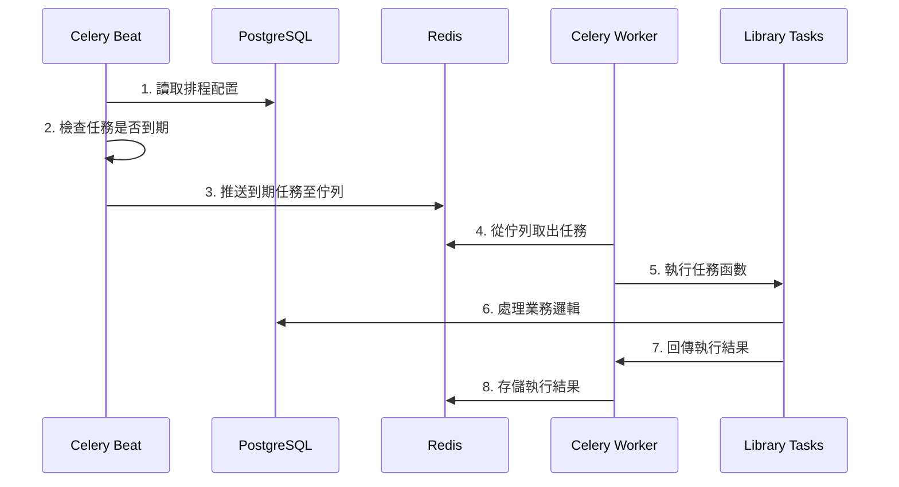

# 🔄 Celery Beat 定時任務架構指南

## 📋 **概述**
本文檔詳細說明 AI Platform 中 Celery Beat 定時任務系統的完整架構、執行原理和監控方式。

**最後更新**: 2025-10-09  
**適用版本**: AI Platform v2.1+  
**維護團隊**: AI Platform Development Team

---

## 🏗️ **系統架構概覽**

### 📊 **容器化分離架構**

```
┌─────────────────────────────────────────────────────────────────┐
│                    AI Platform Celery 架構                      │
├─────────────────────────────────────────────────────────────────┤
│                                                                 │
│  📅 ai-celery-beat      📮 ai-redis        🏃 ai-celery-worker  │
│     (排程器)              (消息佇列)           (執行器)          │
│                                                                 │
│  ⏰ 監控時間表           📋 任務佇列          ⚡ 執行實際工作     │
│  📤 產生定時任務         💾 結果存儲          📊 處理業務邏輯     │
│  🎯 crontab 解析        🔄 消息傳遞          🤖 AI/ML 任務      │
│                                                                 │
└─────────────────────────────────────────────────────────────────┘
                               │
                               ▼
                    ┌─────────────────────┐
                    │   📊 postgres_db     │
                    │   (配置存儲)         │
                    │                     │
                    │  📋 排程配置         │
                    │  📈 執行記錄         │
                    │  📊 統計資料         │
                    └─────────────────────┘
```

## ⚙️ **Celery Beat 執行原理**

### 🔄 **工作流程詳解**



### 📋 **核心組件說明**

#### **1. Celery Beat (ai-celery-beat)**
```yaml
container_name: ai-celery-beat
command: celery -A ai_platform beat --loglevel=info --scheduler django_celery_beat.schedulers:DatabaseScheduler
```

**職責**:
- 🕐 每秒檢查排程配置
- 📅 解析 crontab 表達式
- 🎯 識別到期任務
- 📤 推送任務到 Redis 佇列
- 📊 記錄執行狀態

**配置特點**:
- 使用 **DatabaseScheduler** (而非文件排程器)
- 支援動態配置更新
- 時區感知 (Asia/Taipei)
- 持久化排程狀態

#### **2. Celery Worker (ai-celery-worker)**
```yaml
container_name: ai-celery-worker  
command: celery -A ai_platform worker --loglevel=info --concurrency=2
```

**職責**:
- 🔄 監聽 Redis 任務佇列
- ⚡ 並發執行任務 (concurrency=2)
- 📊 調用實際業務邏輯
- 💾 回報執行結果
- 🚨 處理任務異常

#### **3. Redis 消息佇列 (ai-redis)**
```yaml
container_name: ai-redis
command: redis-server --appendonly yes
```

**職責**:
- 📮 任務消息佇列 (`redis://redis:6379/1`)
- 💾 結果存儲後端 (`redis://redis:6379/2`)
- 🔄 任務狀態追蹤
- ⚡ 高性能消息傳遞

## 📅 **當前排程配置**

### 🕐 **定時任務時間表**

| 任務名稱 | 執行時間 | 頻率 | 目標 |
|---------|----------|------|------|
| `process-new-chat-vectors-hourly` | 每小時 0 分 | 每小時 | 🎯 用戶問題向量化 |
| `process-assistant-vectors-periodic` | 每6小時 30 分 | 每6小時 | 🤖 助手回覆向量化 |
| `update-question-analytics-daily` | 每天 3:30 | 每日 | **📊 聚類分析** |
| `preload-vector-services-daily` | 每天 3:00 | 每日 | 🚀 服務預載入 |
| `cleanup-cache-daily` | 每天 2:00 | 每日 | 🧹 快取清理 |

### 🎯 **關鍵任務詳解**

#### **聚類分析任務 (3:30 AM)**
```python
'update-question-analytics-daily': {
    'task': 'library.rvt_analytics.tasks.precompute_question_classifications',
    'schedule': crontab(hour=3, minute=30),
    'options': {'expires': 3600}
}
```

**執行內容**:
1. **向量聚類** - K-means/DBSCAN 演算法
2. **問題分組** - 相似問題歸類  
3. **統計更新** - 熱門問題排名
4. **快取刷新** - 前端顯示資料

#### **向量處理任務 (每小時)**
```python
'process-new-chat-vectors-hourly': {
    'task': 'library.rvt_analytics.tasks.rebuild_chat_vectors',
    'schedule': crontab(minute=0),
    'kwargs': {
        'force_rebuild': False,
        'user_role': 'user',
        'min_length': 5
    }
}
```

**執行邏輯**:
- 🔍 掃描未向量化的聊天消息
- 🎯 篩選用戶問題 (排除助手回覆)
- 🤖 生成 1024 維向量
- 💾 存儲到 `chat_message_embeddings_1024` 表

## 📊 **監控和管理**

### 🌸 **Celery Flower 監控介面**

**訪問**: `http://localhost:5555`

```yaml
celery_flower:
  container_name: ai-celery-flower
  command: celery -A ai_platform flower --port=5555
```

**監控內容**:
- 📈 任務執行統計
- ⏱️ 執行時間分析
- 🔄 佇列長度監控
- 💻 Worker 狀態檢查
- 🚨 失敗任務追蹤

### 📋 **日誌監控**

#### **Celery Beat 日誌**
```bash
# 檢查排程器狀態
docker logs ai-celery-beat --follow

# 查看特定時間的日誌  
docker logs ai-celery-beat --since="2025-10-09T03:00:00"
```

#### **Celery Worker 日誌**
```bash
# 檢查任務執行
docker logs ai-celery-worker --follow

# 過濾聚類相關任務
docker logs ai-celery-worker | grep "precompute_question"
```

### 🔍 **Redis 佇列檢查**

```bash
# 檢查任務佇列長度
docker exec ai-redis redis-cli LLEN celery

# 查看佇列中的任務
docker exec ai-redis redis-cli LRANGE celery 0 -1

# 檢查結果存儲
docker exec ai-redis redis-cli KEYS "celery-task-meta-*"

# 檢查任務狀態
docker exec ai-redis redis-cli GET "celery-task-meta-<task-id>"
```

## 🛠️ **故障排除指南**

### 🚨 **常見問題與解決方案**

#### **問題 1: 定時任務沒有執行**
```bash
# 1. 檢查 Beat 容器狀態
docker ps | grep celery-beat

# 2. 檢查 Beat 日誌
docker logs ai-celery-beat --tail=50

# 3. 檢查資料庫連接
docker exec ai-celery-beat python manage.py shell -c "
from django.db import connection
connection.ensure_connection()
print('DB 連接正常')
"

# 4. 手動觸發任務測試
docker exec ai-celery-worker python -c "
from library.rvt_analytics.tasks import precompute_question_classifications
result = precompute_question_classifications.apply()
print(f'任務結果: {result}')
"
```

#### **問題 2: Worker 無法處理任務**
```bash
# 1. 檢查 Worker 狀態
docker ps | grep celery-worker

# 2. 檢查 Redis 連接
docker exec ai-celery-worker python -c "
import redis
r = redis.Redis(host='redis', port=6379, db=1)
print(f'Redis 連接: {r.ping()}')
"

# 3. 重啟 Worker
docker restart ai-celery-worker
```

#### **問題 3: 任務執行失敗**
```bash
# 1. 檢查具體錯誤
docker logs ai-celery-worker | grep ERROR

# 2. 檢查資源使用
docker stats ai-celery-worker

# 3. 檢查 Python 環境
docker exec ai-celery-worker python -c "
import library.rvt_analytics.tasks
print('任務模組載入成功')
"
```

### 🔧 **效能調校**

#### **Worker 並發設定**
```yaml
# 根據 CPU 核心數調整
command: celery -A ai_platform worker --concurrency=4
```

#### **任務超時設定**
```python
# 在 celery.py 中
app.conf.task_soft_time_limit = 600  # 10 分鐘軟限制
app.conf.task_time_limit = 900       # 15 分鐘硬限制
```

#### **記憶體優化**
```python
# Worker 自動重啟 (防止記憶體洩漏)
app.conf.worker_max_tasks_per_child = 1000
```

## 📈 **性能指標**

### ✅ **正常運行指標**

| 指標 | 正常值 | 說明 |
|------|--------|------|
| 任務執行成功率 | > 95% | 任務成功完成比例 |
| 平均執行時間 | < 30秒 | 大部分任務的執行時間 |
| 佇列長度 | < 10 | Redis 中等待的任務數 |
| Worker 記憶體使用 | < 512MB | Worker 進程記憶體占用 |
| Beat 響應時間 | < 5秒 | 排程器的響應時間 |

### 📊 **監控腳本**

```bash
#!/bin/bash
# monitor_celery.sh

echo "🔍 Celery 系統狀態監控"
echo "===================="

echo "📊 容器狀態:"
docker ps --format "table {{.Names}}\t{{.Status}}" | grep celery

echo -e "\n📋 佇列狀態:"
QUEUE_LENGTH=$(docker exec ai-redis redis-cli LLEN celery 2>/dev/null || echo "N/A")
echo "任務佇列長度: $QUEUE_LENGTH"

echo -e "\n⚡ 最近任務執行:"
docker logs ai-celery-worker --since="1h" --tail=5 | grep -E "(INFO|ERROR)"

echo -e "\n🕐 下次定時任務:"
docker exec ai-django python manage.py shell -c "
from django_celery_beat.models import PeriodicTask
for task in PeriodicTask.objects.filter(enabled=True)[:3]:
    print(f'{task.name}: {task.crontab}')
" 2>/dev/null
```

## 🚀 **最佳實踐**

### 📝 **開發指南**

#### **新增定時任務**
```python
# 1. 在 celery.py 中添加排程
'new-task-name': {
    'task': 'app.tasks.new_task',
    'schedule': crontab(hour=4, minute=0),
    'kwargs': {'param1': 'value1'}
}

# 2. 在 tasks.py 中實現任務
@shared_task(bind=True)
def new_task(self, param1=None):
    try:
        # 任務邏輯
        return {'success': True}
    except Exception as exc:
        self.retry(exc=exc, countdown=60, max_retries=3)
```

#### **任務設計原則**
1. **冪等性**: 重複執行不會產生副作用
2. **可重試**: 支援自動重試機制
3. **超時控制**: 設定合理的執行時限
4. **錯誤處理**: 優雅處理異常情況
5. **日誌記錄**: 詳細記錄執行過程

### 🔒 **安全考量**

#### **資源限制**
```yaml
# Docker Compose 中設定資源限制
deploy:
  resources:
    limits:
      memory: 512M
      cpus: '0.5'
```

#### **網路隔離**
```yaml
# 使用內部網路
networks:
  - custom_network
```

## 📚 **相關文檔**

- 📖 [Vector Database Architecture](./vector-database-scheduled-update-architecture.md)
- 🔍 [Vector Search Guide](./vector-search-guide.md)
- 🤖 [AI Guidance](./ai-guidance-vector-architecture.md)
- 📊 [RVT Guide Refactoring](./rvt-guide-refactoring-report.md)

---

**維護說明**: 本文檔應隨著系統更新而同步更新，特別是新增定時任務或修改排程配置時。

**緊急聯絡**: 如遇到 Celery Beat 相關的嚴重問題，請立即檢查容器日誌並重啟相關服務。