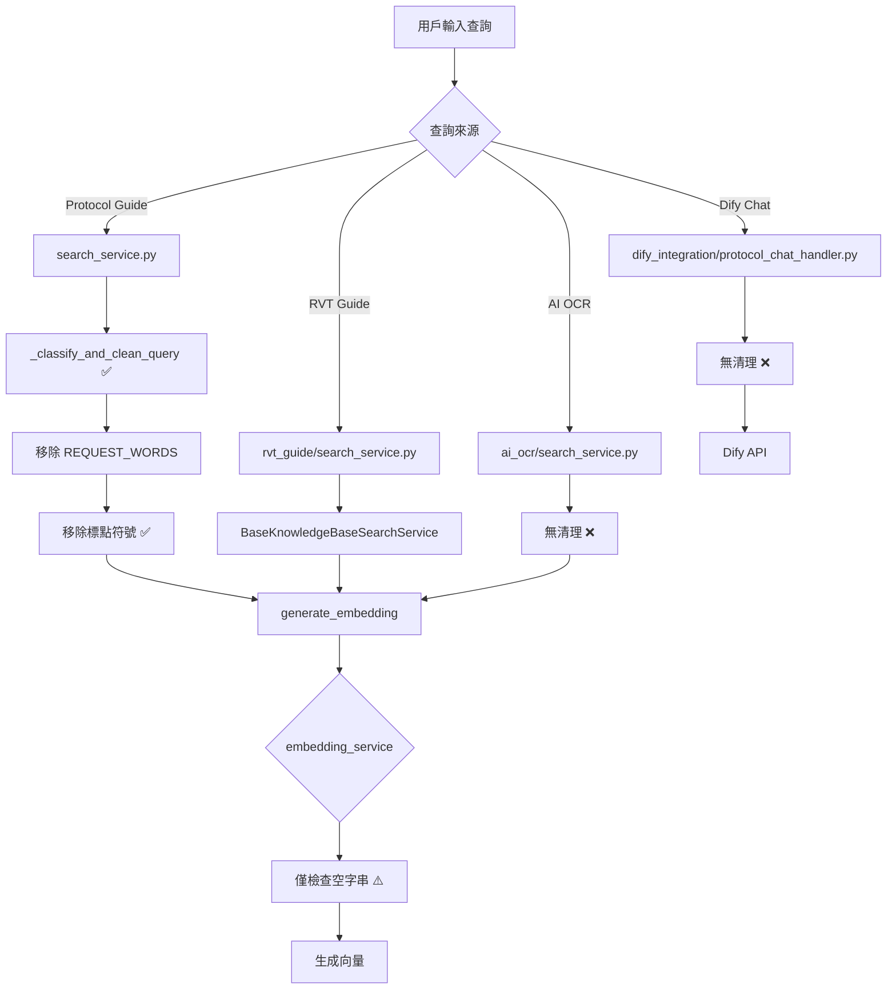

# 查詢清理邏輯審查報告

**生成日期**: 2025-11-26  
**目的**: 識別系統中所有處理用戶查詢的地方，建立完整的查詢處理流程地圖  
**執行階段**: 階段 1 - 識別所有查詢清理點

---

## 📋 執行摘要

### 發現的查詢處理點

| # | 位置 | 函數/類別 | 是否清理查詢 | 風險等級 | 狀態 |
|---|------|----------|------------|---------|------|
| 1 | `library/protocol_guide/search_service.py` | `_classify_and_clean_query()` | ✅ 是 | 🟢 已修復 | 已處理標點問題 |
| 2 | `library/rvt_guide/search_service.py` | `RVTGuideSearchService` | ❌ 否 | 🟢 低 | 繼承基類，無自訂清理 |
| 3 | `library/ai_ocr/search_service.py` | `search_ocr_storage_benchmark()` | ❌ 否 | 🟡 中 | 待確認 |
| 4 | `backend/api/services/embedding_service.py` | `generate_embedding()` | ⚠️ 部分 | 🟡 中 | 僅檢查空字串 |
| 5 | `library/common/knowledge_base/section_search_service.py` | `semantic_search()` | ❌ 否 | 🟡 中 | 直接生成 embedding |
| 6 | `library/protocol_guide/smart_search_router.py` | `route_search_strategy()` | ❌ 否 | 🟢 低 | 路由邏輯，不清理 |
| 7 | `library/dify_integration/protocol_chat_handler.py` | `dify_protocol_chat_api()` | ❌ 否 | 🟡 中 | 直接傳給 Dify |

---

## 🔍 詳細分析

### 1. Protocol Guide Search Service ✅ **已修復**

**位置**: `library/protocol_guide/search_service.py`

**函數**: `_classify_and_clean_query(self, query: str) -> tuple`

**清理步驟**（正確順序）：
```python
# Line 112-141
1. 初始化: cleaned_query = query
2. 空格正規化（第一次）: cleaned_query.split()
3. 移除 REQUEST_WORDS: ['是什麼', '什麼是', '如何', ...]
4. 移除標點符號 ✅ (已修復): ['？', '?', '！', '!', ...]
5. 最終空格清理: ' '.join(cleaned_query.split()).strip()
6. 大寫縮寫轉換: uppercase_acronyms()
7. 驗證非空: if not cleaned_query → 返回 'list_all' 或保留原查詢
```

**輸入/輸出範例**:
```python
輸入: 'CrystalDiskMark 是什麼？'
輸出: ('section', 'CrystalDiskMark')  ✅

輸入: '？？？'
輸出: ('list_all', '') 或保留原查詢  ✅
```

**風險評估**: 🟢 **低風險** - 已修復標點問題，邏輯完整

**改進建議**:
- ✅ 標點移除已添加（Line 135-138）
- ⚠️ 建議添加後置驗證邏輯
- ⚠️ 建議統一到 QueryCleaner 類別

---

### 2. RVT Guide Search Service

**位置**: `library/rvt_guide/search_service.py`

**類別**: `RVTGuideSearchService(BaseKnowledgeBaseSearchService)`

**查詢處理**:
```python
class RVTGuideSearchService(BaseKnowledgeBaseSearchService):
    # 繼承基礎搜索服務
    # 沒有自訂的查詢清理邏輯
    pass
```

**查詢流程**:
1. 用戶查詢 → `search_knowledge(query_text, ...)`
2. 基類處理 → `BaseKnowledgeBaseSearchService`
3. 直接生成向量 → `embedding_service.generate_embedding(query_text)`

**問題識別**: ❌ **沒有查詢清理**

**風險評估**: 🟢 **低風險** - 因為：
- RVT Guide 主要用於簡單的知識庫查詢
- 沒有複雜的分類邏輯
- 直接向量搜尋較穩健

**改進建議**:
- 建議在 `BaseKnowledgeBaseSearchService` 添加通用清理
- 或在調用 `generate_embedding()` 前清理

---

### 3. AI OCR Search Service

**位置**: `library/ai_ocr/search_service.py`

**函數**: `search_ocr_storage_benchmark(self, query_text, limit=5)`

**查詢處理**:
```python
def search_ocr_storage_benchmark(self, query_text, limit=5):
    # 直接使用 query_text，沒有清理
    # ...
```

**問題識別**: ❌ **沒有查詢清理**

**風險評估**: 🟡 **中風險** - 因為：
- OCR 查詢可能包含標點符號
- 用戶可能輸入問句
- 缺少防禦性檢查

**測試案例**:
```python
# 可能有問題的輸入
'OCR 結果是什麼？'  # 標點殘留
'OCR、Storage、Benchmark'  # 中文標點
'？？？'  # 純標點
```

**改進建議**:
- 添加查詢清理步驟
- 使用統一的 QueryCleaner
- 添加空查詢檢查

---

### 4. Embedding Service ⚠️ **部分處理**

**位置**: `backend/api/services/embedding_service.py`

**函數**: `generate_embedding(self, text: str) -> List[float]`

**當前邏輯**（Line 88-108）:
```python
def generate_embedding(self, text: str) -> List[float]:
    try:
        if not text or not text.strip():
            return [0.0] * self.embedding_dimension  # 返回零向量
            
        # 使用模型生成嵌入
        embedding = self.model.encode(text.strip())  # 僅 strip()
        
        # ...
        return embedding
        
    except Exception as e:
        logger.error(f"生成嵌入失敗: {str(e)}")
        return [0.0] * self.embedding_dimension
```

**問題識別**: ⚠️ **僅檢查空字串，不處理標點**

**風險評估**: 🟡 **中風險** - 因為：
- 純標點查詢會通過檢查（如 '？？？'.strip() != ''）
- 可能導致低品質向量
- 沒有記錄異常輸入

**測試案例**:
```python
# 當前行為
generate_embedding('？？？')  
# → 不會返回零向量，會生成「標點符號」的向量

generate_embedding('')  
# → 返回零向量 ✅

generate_embedding('   ')  
# → 返回零向量 ✅
```

**改進建議**:
```python
def generate_embedding(self, text: str) -> List[float]:
    try:
        # 驗證 1：非空
        if not text or not text.strip():
            logger.warning(f"❌ 文本為空，返回零向量")
            return [0.0] * self.embedding_dimension
        
        # 驗證 2：不是純標點 ✨ 新增
        cleaned = text.strip()
        PUNCTUATION = ['？', '?', '！', '!', '。', '.', '，', ',', '、', '：', ':', '；', ';']
        if all(char in PUNCTUATION or char == ' ' for char in cleaned):
            logger.warning(f"❌ 文本為純標點：'{cleaned}'，返回零向量")
            return [0.0] * self.embedding_dimension
        
        # 驗證 3：長度合理 ✨ 新增
        if len(cleaned) > 500:
            logger.warning(f"⚠️ 文本過長 ({len(cleaned)} 字元)，截斷至 500 字元")
            cleaned = cleaned[:500]
        
        # 生成向量
        embedding = self.model.encode(cleaned)
        
        # 驗證 4：向量有效 ✨ 新增
        if embedding is None or len(embedding) == 0:
            logger.error(f"❌ 向量生成失敗：返回值為 None 或空")
            return [0.0] * self.embedding_dimension
        
        return embedding.tolist()
        
    except Exception as e:
        logger.error(f"❌ 生成嵌入異常: {str(e)}, 文本: '{text[:50]}...'")
        return [0.0] * self.embedding_dimension
```

---

### 5. Section Search Service

**位置**: `library/common/knowledge_base/section_search_service.py`

**函數**: `semantic_search()` (推測，根據 grep 結果)

**查詢處理**: 
```python
# Line 131 (grep 結果)
query_embedding = self.embedding_service.generate_embedding(query)
```

**問題識別**: ❌ **直接生成向量，沒有清理**

**風險評估**: 🟡 **中風險**

**改進建議**:
- 在生成向量前添加查詢清理
- 使用統一的 QueryCleaner

---

### 6. Smart Search Router

**位置**: `library/protocol_guide/smart_search_router.py`

**函數**: `route_search_strategy(self, user_query: str) -> str`

**用途**: 路由搜尋策略（不負責清理查詢）

**風險評估**: 🟢 **低風險** - 路由邏輯不需要清理

---

### 7. Dify Chat Handler

**位置**: `library/dify_integration/protocol_chat_handler.py`

**函數**: `dify_protocol_chat_api()`

**查詢處理**: 直接傳遞給 Dify API

**問題識別**: ❌ **沒有清理，直接傳給 Dify**

**風險評估**: 🟡 **中風險** - 因為：
- Dify 可能無法處理特殊字符
- 沒有前置過濾

**改進建議**:
- 考慮在傳給 Dify 前清理
- 至少記錄原始查詢

---

## 🎯 查詢處理流程圖



---

## 📊 風險統計

| 風險等級 | 數量 | 百分比 | 處理點 |
|---------|------|--------|--------|
| 🔴 高風險 | 0 | 0% | - |
| 🟡 中風險 | 4 | 57% | AI OCR, Embedding Service, Section Search, Dify Chat |
| 🟢 低風險 | 3 | 43% | Protocol Guide (已修復), RVT Guide, Smart Router |

---

## ⚠️ 關鍵發現

### 1. **標點符號問題（已修復）**
- ✅ Protocol Guide 已修復
- ❌ 其他處理點未處理標點

### 2. **清理邏輯分散**
- 只有 Protocol Guide 有完整清理
- 其他處理點缺少統一標準

### 3. **缺少驗證機制**
- Embedding Service 僅檢查空字串
- 沒有後置驗證（如檢查清理後是否包含標點）

### 4. **邊界情況處理不足**
- 純標點查詢：'？？？'
- 過長查詢：> 500 字元
- SQL 注入風險字符：';', '--', 等

---

## 🎯 改進建議優先級

### Priority 1 - 🔴 立即執行

1. **統一清理邏輯**
   - 創建 `QueryCleaner` 類別
   - 定義標準清理流程
   - 所有查詢處理點使用統一工具

2. **Embedding Service 增強**
   - 添加純標點檢測
   - 添加長度檢查
   - 添加向量有效性驗證

### Priority 2 - 🟡 本週完成

3. **AI OCR Search Service**
   - 添加查詢清理步驟
   - 使用 QueryCleaner

4. **Section Search Service**
   - 在生成向量前清理查詢

5. **Dify Chat Handler**
   - 添加前置清理（可選）
   - 至少記錄原始查詢

### Priority 3 - 🟢 未來改進

6. **監控和告警**
   - 記錄清理異常
   - 統計清理後為空的比例

7. **文檔化**
   - 創建查詢清理開發指南
   - 更新 Code Review 檢查清單

---

## 📝 下一步行動

**階段 1 完成** ✅

**準備階段 2**：分析每個清理點的邏輯

具體待檢查：
1. Protocol Guide 清理邏輯的完整性（順序、邊界情況）
2. 其他處理點需要添加清理的地方
3. 設計統一的 QueryCleaner 接口

**預計時間**: 3 小時

---

## 📋 附錄：關鍵代碼位置

```
library/protocol_guide/search_service.py
  Line 75-188: _classify_and_clean_query() ✅ 已修復

library/rvt_guide/search_service.py
  Line 1-76: RVTGuideSearchService (繼承基類)

library/ai_ocr/search_service.py
  Line 24-51: search_ocr_storage_benchmark() ❌ 需要添加清理

backend/api/services/embedding_service.py
  Line 88-108: generate_embedding() ⚠️ 需要增強驗證

library/common/knowledge_base/section_search_service.py
  Line 131: semantic_search() ❌ 需要添加清理

library/dify_integration/protocol_chat_handler.py
  查詢直接傳給 Dify ❌ 考慮添加清理
```

---

**報告完成日期**: 2025-11-26  
**審查人員**: AI Assistant  
**狀態**: 階段 1 完成，等待進入階段 2
