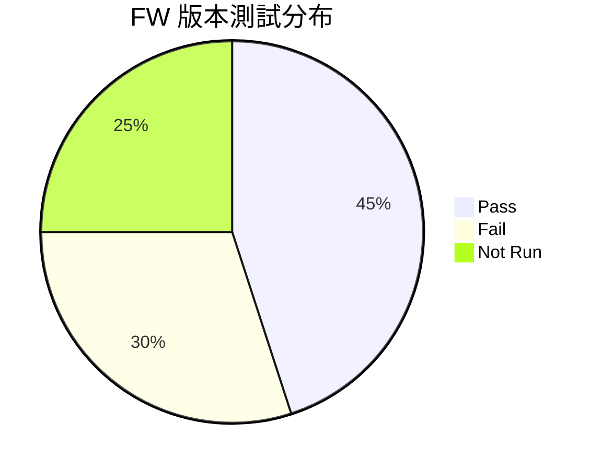

```mermaid
xychart-beta
    title "FW 版本比較"
    x-axis ["G200X81A", "G200X82B", "G200X8CA"]
    y-axis "數量" 0 --> 20
    bar [5, 0, 0]
    bar [8, 14, 11]
```

# SAF Assistant FW 版本比較功能增強計畫

## 📋 文件資訊

| 項目 | 內容 |
|------|------|
| **文件名稱** | SAF Assistant FW 版本比較功能增強計畫 |
| **建立日期** | 2025-12-07 |
| **作者** | AI Platform Team |
| **狀態** | 📝 規劃中 |
| **相關模組** | `library/saf_integration/smart_query/` |

---

## 🎯 目標概述

增強 SAF Assistant 的 FW 版### 第四階段（未來）

| Phase | 功能 | 工時 | 優先級 |
|-------|------|------|--------|
| 5.5.1 | 跨專案比較 | 8h | ⭐ |
| 5.5.2 | 同客戶專案比較 | 8h | ⭐ |
| **小計** | | **16h** | |

### 第五階段（圖表渲染支援）

| Phase | 功能 | 工時 | 優先級 |
|-------|------|------|--------|
| 5.6.1 | 前端 Mermaid 支援 | 3h | ⭐⭐ |
| 5.6.2 | 後端圖表格式輸出 | 2h | ⭐⭐ |
| 5.6.3 | 樣式調整 | 1h | ⭐⭐ |
| **小計** | | **6h** | |

### 📊 總工時彙總

| 階段 | 工時 | 說明 |
|------|------|------|
| 第一階段 | 7h | 智能版本選擇（基礎） |
| 第二階段 | 5h | 細緻化比較（次優先） |
| 第三階段 | 9h | 趨勢分析（可選） |
| 第四階段 | 16h | 跨專案比較（未來） |
| 第五階段 | 6h | 圖表渲染支援（可選） |
| **總計** | **43h** | |

---

## 📈 圖表渲染可行性評估、更豐富的比較分析能力，提升用戶體驗和工作效率。

---

## 📊 現有功能分析

### ✅ 已實現功能（Phase 5.1）

| 功能 | 說明 | 狀態 |
|------|------|------|
| 指定兩版本比較 | 比較用戶指定的兩個 FW 版本 | ✅ 完成 |
| 測試結果比較 | Pass/Fail/通過率對比 | ✅ 完成 |
| 整體指標比較 | 完成率/執行率/失敗率/樣本使用 | ✅ 完成 |
| 按類別比較 | MANDi/Performance/Security 等分類比較 | ✅ 完成 |
| 趨勢分析 | 改善/退步/持平判斷 | ✅ 完成 |

### 📝 現有問句範例

```
✅ 支援：
- "Springsteen 專案的 G200X82B 和 G200X8CA 比較"
- "比較 Demeter 的 Y1114A 和 Y1114B"
- "DEMETER FW Y1114B vs Y1114A"

❌ 不支援：
- "Springsteen 最新的 FW 比較" （需要知道具體版本名）
- "Springsteen 有哪些 FW 版本？" （無法列出可用版本）
- "比較 Springsteen 最近三個版本" （只支援兩個版本）
```

---

## 🚀 增強計畫

### Phase 5.2：智能版本選擇（⭐⭐⭐ 高優先級）

#### 5.2.1 自動選擇最新兩版本比較

**目標**：用戶不需要知道具體 FW 版本名稱，系統自動選擇最新兩個版本比較

**新增意圖**：`compare_latest_fw`

**支援問句**：
```
- "Springsteen 最新的 FW 比較"
- "比較 Demeter 最近兩個版本"
- "Springsteen 的 FW 進度比較"
- "看一下 DEMETER 最新版本差異"
```

**實作要點**：
1. 獲取專案下所有子專案（FW 版本）
2. 按建立時間或版本號排序
3. 取最新兩個版本
4. 複用現有 `compare_fw_versions` 邏輯

**預估工時**：4 小時

---

#### 5.2.2 列出可比較的 FW 版本

**目標**：讓用戶知道有哪些 FW 版本可以比較

**新增意圖**：`list_fw_versions`

**支援問句**：
```
- "Springsteen 有哪些 FW 版本？"
- "列出 Demeter 的所有 FW"
- "Springsteen 可以比較哪些版本？"
```

**輸出格式**：
```markdown
📋 Springsteen 專案 FW 版本列表

共找到 **5** 個 FW 版本：

| # | FW 版本 | 完成率 | Pass | Fail | 建立時間 |
|---|---------|--------|------|------|----------|
| 1 | G200X8CA | 11.0% | 0 | 11 | 2025-12-01 |
| 2 | G200X82B | 68.0% | 0 | 14 | 2025-11-28 |
| 3 | G200X81A | 45.0% | 5 | 8 | 2025-11-20 |
| ... | ... | ... | ... | ... | ... |

💡 提示：您可以問「比較 Springsteen 的 G200X8CA 和 G200X82B」
```

**預估工時**：3 小時

---

### Phase 5.3：比較結果增強（⭐⭐ 中優先級）

#### 5.3.1 按容量 (Capacity) 比較

**目標**：顯示各容量（512GB/1TB/2TB/4TB）的測試結果差異

**修改位置**：`compare_fw_versions_handler.py` → `_format_comparison_response()`

**新增輸出區塊**：
```markdown
### 📦 按容量比較
| 容量 | G200X82B (Pass/Fail) | G200X8CA (Pass/Fail) | Pass 變化 | Fail 變化 |
|------|----------------------|----------------------|-----------|-----------|
| 512GB | 0/3 | 0/2 | 0 ➡️ | +1 ⬆️ |
| 1024GB | 0/4 | 0/3 | 0 ➡️ | +1 ⬆️ |
| 2048GB | 0/4 | 0/3 | 0 ➡️ | +1 ⬆️ |
| 4096GB | 0/3 | 0/3 | 0 ➡️ | 0 ➡️ |
```

**預估工時**：2 小時

---

#### 5.3.2 重點異常標記

**目標**：當某類別/容量的 Fail 增加超過 50% 時，特別標記提醒

**標記方式**：
```markdown
| MANDi | 0/8 | 0/3 | 0 ➡️ | +5 ⬆️ ⚠️ |  ← 加上警告標記
```

**觸發條件**：
- Fail 增加 >= 50%
- 或 Fail 絕對值增加 >= 5

**預估工時**：1 小時

---

#### 5.3.3 改善/惡化類別摘要

**目標**：自動列出「改善最多」和「惡化最多」的類別

**新增輸出區塊**：
```markdown
### 🔍 重點變化

**📈 改善最多的類別：**
- Security：Fail -3 ⬇️

**📉 需要關注的類別：**
- MANDi：Fail +5 ⬆️ ⚠️
```

**預估工時**：2 小時

---

### Phase 5.4：多版本比較（⭐ 低優先級）

#### 5.4.1 三個以上版本趨勢

**目標**：支援比較 3 個或更多 FW 版本的趨勢

**新增意圖**：`compare_multiple_fw_versions`

**支援問句**：
```
- "比較 Springsteen 的 A、B、C 三個版本"
- "Demeter 最近三個版本的趨勢"
```

**輸出格式**：
```markdown
### 📊 多版本趨勢比較

| 指標 | G200X81A | G200X82B | G200X8CA | 趨勢 |
|------|----------|----------|----------|------|
| Pass | 5 | 0 | 0 | 📉 |
| Fail | 8 | 14 | 11 | 📈📉 |
| 完成率 | 45% | 68% | 11% | 📈📉 |
```

**預估工時**：6 小時

---

#### 5.4.2 版本演進圖表資料

**目標**：輸出適合前端繪製趨勢圖的 JSON 資料

**輸出格式**：
```json
{
  "chart_data": {
    "labels": ["G200X81A", "G200X82B", "G200X8CA"],
    "datasets": [
      {
        "label": "Pass",
        "data": [5, 0, 0]
      },
      {
        "label": "Fail", 
        "data": [8, 14, 11]
      },
      {
        "label": "完成率",
        "data": [45, 68, 11]
      }
    ]
  }
}
```

**預估工時**：3 小時

---

### Phase 5.5：跨專案比較（⭐ 未來規劃）

#### 5.5.1 跨專案比較

**目標**：比較不同專案的測試進度

**支援問句**：
```
- "比較 Springsteen 和 Demeter 的測試進度"
- "哪個專案進度比較快？"
```

**預估工時**：8 小時

---

#### 5.5.2 同客戶專案比較

**目標**：比較同一客戶下所有專案的狀態

**支援問句**：
```
- "比較 Micron 所有專案的通過率"
- "WD 的專案哪個表現最好？"
```

**預估工時**：8 小時

---

## 📅 實施時程建議

### 第一階段（建議優先）

| Phase | 功能 | 工時 | 優先級 |
|-------|------|------|--------|
| 5.2.1 | 自動選擇最新兩版本比較 | 4h | ⭐⭐⭐ |
| 5.2.2 | 列出可比較的 FW 版本 | 3h | ⭐⭐⭐ |
| **小計** | | **7h** | |

### 第二階段（次優先）

| Phase | 功能 | 工時 | 優先級 |
|-------|------|------|--------|
| 5.3.1 | 按容量比較 | 2h | ⭐⭐ |
| 5.3.2 | 重點異常標記 | 1h | ⭐⭐ |
| 5.3.3 | 改善/惡化類別摘要 | 2h | ⭐⭐ |
| **小計** | | **5h** | |

### 第三階段（可選）

| Phase | 功能 | 工時 | 優先級 |
|-------|------|------|--------|
| 5.4.1 | 多版本趨勢比較 | 6h | ⭐ |
| 5.4.2 | 圖表資料輸出 | 3h | ⭐ |
| **小計** | | **9h** | |

### 第四階段（未來）

| Phase | 功能 | 工時 | 優先級 |
|-------|------|------|--------|
| 5.5.1 | 跨專案比較 | 8h | ⭐ |
| 5.5.2 | 同客戶專案比較 | 8h | ⭐ |
| **小計** | | **16h** | |

---

## � 圖表渲染可行性評估

### 現有技術架構分析

| 項目 | 現況 |
|------|------|
| **前端 Markdown 渲染** | `ReactMarkdown` |
| **圖表庫** | `Recharts`（已在 DashboardPage 使用） |
| **聊天訊息格式化** | `MessageFormatter.jsx` |
| **CSS 樣式** | `ReactMarkdown.css` |

### 可行方案評估

#### 方案 A：Mermaid 圖表語法（⭐⭐⭐ 推薦）

**原理**：在 Markdown 中使用 Mermaid 語法，前端透過 `mermaid.js` 或 `react-mermaid2` 渲染

**優點**：
- ✅ Markdown 標準擴展語法，廣泛支援
- ✅ 後端只需輸出純文字格式
- ✅ 支援長條圖、圓餅圖、流程圖等
- ✅ 有現成的 React 組件可用

**缺點**：
- ❌ 圖表樣式較為固定
- ❌ 需要額外安裝 `mermaid` 或 `react-mermaid2`

**輸出格式範例**：
````markdown

````

**長條圖範例**：
````markdown

````

**實作工時**：4-6 小時

---

#### 方案 B：Recharts 自定義組件（⭐⭐ 中等推薦）

**原理**：後端輸出特殊標記 + JSON 資料，前端偵測並渲染為 Recharts 圖表

**優點**：
- ✅ 專案已有 Recharts，無需新安裝
- ✅ 圖表樣式可完全自訂
- ✅ 互動性更好（hover、tooltip）

**缺點**：
- ❌ 需要自定義 MessageFormatter 解析邏輯
- ❌ 後端輸出格式需要特殊設計
- ❌ 實作複雜度較高

**輸出格式範例**：
```markdown
這是比較結果說明...

[CHART:BAR]
{
  "title": "FW 版本比較",
  "data": [
    {"name": "G200X82B", "pass": 0, "fail": 14},
    {"name": "G200X8CA", "pass": 0, "fail": 11}
  ]
}
[/CHART]

以上是分析結果。
```

**實作工時**：8-12 小時

---

#### 方案 C：Chart.js + Markdown（⭐ 備選）

**原理**：類似方案 B，但使用 `react-chartjs-2`

**優點**：
- ✅ Chart.js 生態系成熟
- ✅ 支援更多圖表類型

**缺點**：
- ❌ 需要額外安裝新的圖表庫
- ❌ 與現有 Recharts 重複
- ❌ 學習成本

**實作工時**：10-14 小時

---

#### 方案 D：ASCII 圖表（⭐ 簡易方案）

**原理**：直接輸出 ASCII 文字圖表

**優點**：
- ✅ 無需任何前端修改
- ✅ 實作最簡單

**缺點**：
- ❌ 視覺效果差
- ❌ 複雜資料難以呈現

**輸出格式範例**：
```
FW 版本比較
───────────────────────────────
G200X82B │████████████████ 14 (Fail)
G200X8CA │███████████ 11 (Fail)
───────────────────────────────
```

**實作工時**：2-3 小時

---

### 📊 方案比較總結

| 方案 | 視覺效果 | 實作難度 | 工時 | 推薦度 |
|------|----------|----------|------|--------|
| **A. Mermaid** | ⭐⭐⭐⭐ | 中等 | 4-6h | ⭐⭐⭐ **推薦** |
| **B. Recharts 自定義** | ⭐⭐⭐⭐⭐ | 較高 | 8-12h | ⭐⭐ |
| **C. Chart.js** | ⭐⭐⭐⭐⭐ | 高 | 10-14h | ⭐ |
| **D. ASCII** | ⭐⭐ | 簡單 | 2-3h | ⭐ |

---

### 🎯 推薦實施：方案 A（Mermaid）

**理由**：
1. **標準化**：Mermaid 是 Markdown 擴展的事實標準
2. **易維護**：後端只輸出純文字，前端統一渲染
3. **低風險**：成熟的開源方案，社群支援良好
4. **可擴展**：未來可支援流程圖、甘特圖等

**實施步驟**：
1. 安裝 `mermaid` 或 `react-mermaid2`
2. 修改 `MessageFormatter.jsx` 支援 Mermaid 程式碼區塊
3. 後端 Handler 輸出 Mermaid 格式的圖表

**Phase 5.6（新增）：圖表渲染支援**

| 項目 | 工時 | 說明 |
|------|------|------|
| 5.6.1 前端 Mermaid 支援 | 3h | 安裝依賴、修改 MessageFormatter |
| 5.6.2 後端圖表格式輸出 | 2h | 修改 compare_fw_versions_handler |
| 5.6.3 樣式調整 | 1h | CSS 美化 |
| **小計** | **6h** | |

---

## �🔧 技術實作要點

### 新增檔案

```
library/saf_integration/smart_query/
├── query_handlers/
│   ├── compare_fw_versions_handler.py      # 現有，需增強
│   ├── compare_latest_fw_handler.py        # 新增 (Phase 5.2.1)
│   ├── list_fw_versions_handler.py         # 新增 (Phase 5.2.2)
│   └── compare_multiple_fw_handler.py      # 新增 (Phase 5.4.1)
└── intent_types.py                          # 需新增意圖類型
```

### 新增意圖類型

```python
# intent_types.py 新增

class IntentType(Enum):
    # ... 現有意圖
    
    # Phase 5.2 新增
    COMPARE_LATEST_FW = "compare_latest_fw"
    LIST_FW_VERSIONS = "list_fw_versions"
    
    # Phase 5.4 新增
    COMPARE_MULTIPLE_FW_VERSIONS = "compare_multiple_fw_versions"
```

### Dify Prompt 更新

需要更新 Dify 的意圖分析 Prompt，新增對應的意圖判斷規則：

```
新增意圖：
- compare_latest_fw: 用戶想比較最新的 FW 版本，但沒有指定具體版本名
- list_fw_versions: 用戶想知道有哪些 FW 版本可以比較
- compare_multiple_fw_versions: 用戶想比較 3 個或更多版本
```

---

## 📝 驗收標準

### Phase 5.2 驗收標準

- [ ] 「Springsteen 最新的 FW 比較」能正確返回最新兩版本的比較結果
- [ ] 「Springsteen 有哪些 FW 版本」能列出所有可用版本
- [ ] 版本列表包含完成率、Pass/Fail 等基本資訊
- [ ] 列表按時間或版本號正確排序

### Phase 5.3 驗收標準

- [ ] 比較結果包含按容量分類的表格
- [ ] Fail 增加超過 50% 的項目有 ⚠️ 標記
- [ ] 自動生成「改善最多」和「需要關注」的摘要

### Phase 5.4 驗收標準

- [ ] 支援比較 3-5 個 FW 版本
- [ ] 輸出包含圖表可用的 JSON 資料
- [ ] 趨勢分析能正確識別整體走向

---

## 📚 相關文件

- [SAF Integration 架構文件](/docs/architecture/saf-integration-architecture.md)
- [Smart Query 開發指南](/docs/development/saf-smart-query-guide.md)
- [Intent Types 定義](/library/saf_integration/smart_query/intent_types.py)

---

## 📝 更新記錄

| 日期 | 版本 | 更新內容 | 作者 |
|------|------|----------|------|
| 2025-12-07 | v1.0 | 初版建立 | AI Platform Team |

---

**📌 下一步行動**：確認優先實施的 Phase，開始執行開發工作。
