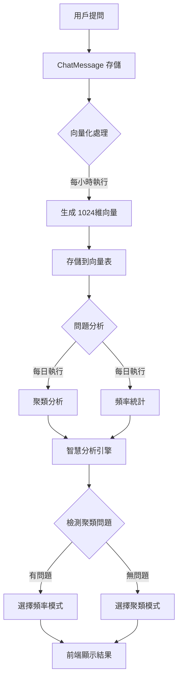
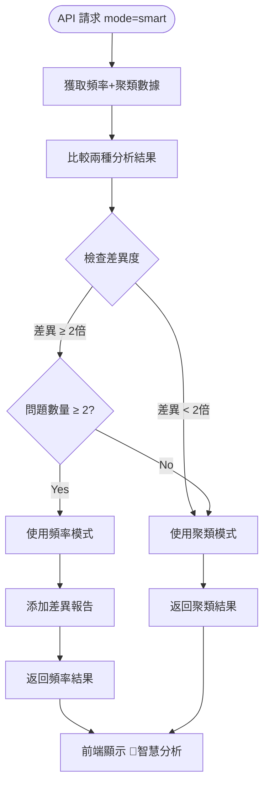
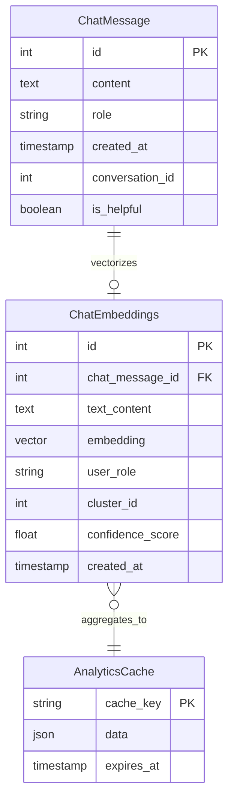
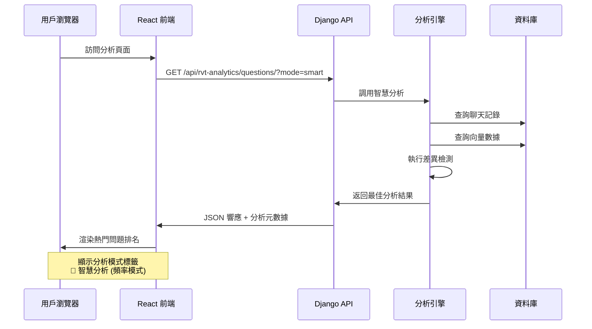
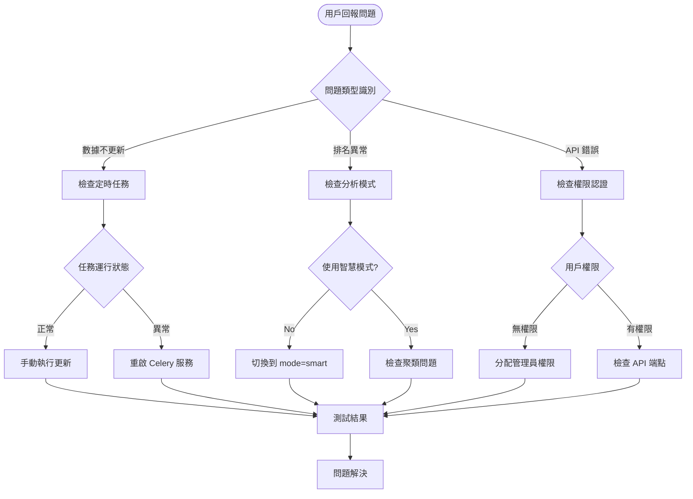
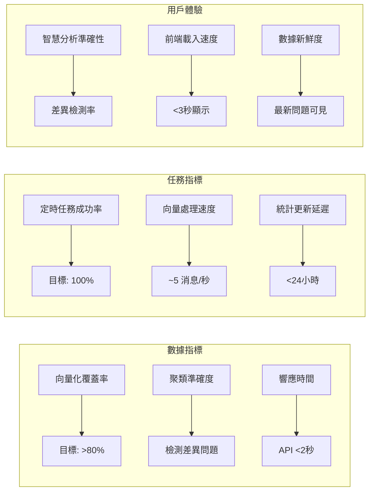
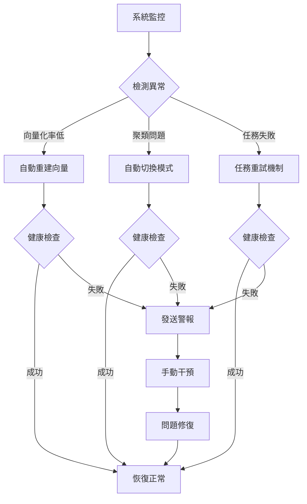

# 🔄 RVT Assistant 分析系統運作流程圖

## 📋 **系統運作概覽**



---

## 🎯 **智慧分析決策流程**



---

## 🕐 **定時任務執行時序**

```mermaid
gantt
    title RVT Assistant 定時任務執行計劃
    dateFormat HH:mm
    axisFormat %H:%M
    
    section 每小時任務
    用戶問題向量化    :active, hourly1, 00:00, 10m
    用戶問題向量化    :hourly2, 01:00, 10m
    用戶問題向量化    :hourly3, 02:00, 10m
    用戶問題向量化    :hourly4, 03:00, 10m
    
    section 每日凌晨任務  
    快取清理        :cleanup, 02:00, 15m
    向量服務預載入   :preload, 03:00, 20m
    問題分類更新    :analytics, 03:30, 30m
    
    section 每6小時任務
    助手回覆向量化   :assistant1, 00:30, 15m
    助手回覆向量化   :assistant2, 06:30, 15m
    助手回覆向量化   :assistant3, 12:30, 15m
    助手回覆向量化   :assistant4, 18:30, 15m
```



---

## 🗄️ **數據流架構**



---

## 🌊 **前端數據流**



---

## 🔧 **問題診斷流程**



---

## 📊 **性能監控指標**



---

## 🔄 **系統自癒機制**



---

## 🚀 **部署更新流程**

```mermaid
gitgraph
    commit id: "開發新功能"
    branch feature
    checkout feature
    commit id: "實現智慧分析"
    commit id: "添加前端顯示"
    checkout main
    merge feature
    commit id: "測試通過"
    commit id: "部署到生產" tag: "v2.1"
    
    commit id: "監控運行狀態"
    branch hotfix
    checkout hotfix
    commit id: "修復聚類問題"
    checkout main
    merge hotfix
    commit id: "熱修復部署" tag: "v2.1.1"
```

---

## 📋 **運維檢查清單**

### **日常監控** ✅
- [ ] Celery Beat 任務執行狀態
- [ ] 向量化處理成功率
- [ ] API 響應時間監控
- [ ] 資料庫連接健康度
- [ ] 前端頁面載入正常

### **週期性維護** 🔧
- [ ] 清理過期向量數據
- [ ] 重建向量索引
- [ ] 更新聚類參數
- [ ] 備份統計數據
- [ ] 性能基準測試

### **故障應對** 🚨
- [ ] 定時任務失敗處理
- [ ] 向量服務異常恢復
- [ ] API 端點故障修復
- [ ] 數據不一致修正
- [ ] 前端顯示異常處理

---

**🎯 此流程圖文檔幫助 AI 助手理解系統各組件間的協作關係和數據流轉過程。**