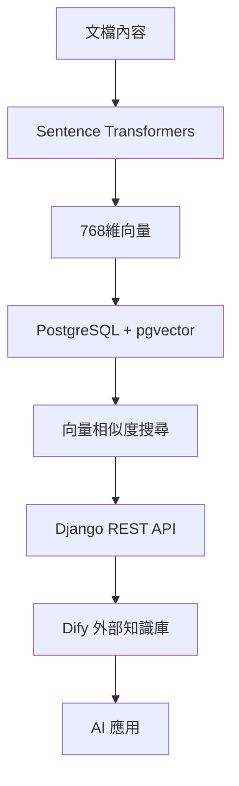

# AI Platform 向量搜尋系統總覽

## 📖 文檔說明

本專案實現了基於開源技術的向量搜尋系統，為 AI Platform 提供語義搜尋能力。以下是完整的知識文檔結構：

---

## 📚 文檔結構

### 🎯 主要文檔
1. **[vector-search-guide.md](./vector-search-guide.md)** - 完整的系統建立和使用指南
2. **[vector-search-quick-reference.md](./vector-search-quick-reference.md)** - 快速參考和常用命令
3. **[ai-vector-search-guide.md](./ai-vector-search-guide.md)** - AI 助手專用操作指南

### 🔗 相關文檔
- **[dify-external-knowledge-api-guide.md](./guide/dify-external-knowledge-api-guide.md)** - Dify 外部知識庫整合
- **[api-integration.md](./guide/api-integration.md)** - API 整合說明
- **[backend-development.md](./guide/backend-development.md)** - 後端開發指南

---

## 🏗️ 系統架構概要



### 核心組件
- **向量模型**: Sentence Transformers (開源多語言)
- **向量資料庫**: PostgreSQL + pgvector 擴展
- **API 服務**: Django REST Framework
- **知識來源**: RVT Guide 文檔
- **應用整合**: Dify 外部知識庫

---

## 🚀 快速開始流程

### 1. 環境準備
```bash
# 檢查 pgvector 擴展
docker exec postgres_db psql -U postgres -d ai_platform -c "SELECT * FROM pg_extension WHERE extname = 'vector';"

# 安裝 Python 依賴
docker exec ai-django pip install sentence-transformers torch transformers
```

### 2. 資料建立
```bash
# 創建 RVT Guide 資料
docker exec ai-django python manage.py create_rvt_guide_data

# 生成向量嵌入
docker exec ai-django python manage.py generate_rvt_embeddings
```

### 3. 功能測試
```bash
# API 測試
curl -X POST "http://10.10.172.127/api/dify/knowledge/retrieval/" \
  -H "Content-Type: application/json" \
  -d '{"knowledge_id": "rvt_guide_db", "query": "Jenkins 測試階段"}'
```

---

## 🔧 核心功能

### 支援的向量模型
- **lightweight**: 384維，快速回應
- **standard**: 768維，平衡精準度與效能（推薦）
- **high_precision**: 768維，最高精準度

### 搜尋能力
- **語義搜尋**: 理解查詢意圖，而非僅關鍵字匹配
- **多語言支援**: 中文和英文混合查詢
- **相似度評分**: 0.0-1.0 的相似度分數
- **結果過濾**: 可設定相似度閾值和結果數量

### API 端點
```
主要端點: /api/dify/knowledge/retrieval/
RVT 專用: /api/dify/rvt-guide/retrieval/
配置端點: /api/rvt-guide/config/
聊天端點: /api/rvt-guide/chat/
```

---

## 📊 知識庫內容

### RVT Guide 文檔類型
- **系統架構**: Jenkins + Ansible 概念說明
- **操作流程**: 測試階段、參數配置
- **環境準備**: 先決條件、硬體需求
- **配置管理**: Ansible 設定、測試平台配置
- **故障排除**: 常見問題與解決方案

### 文檔結構
```
RVTGuide 模型:
├── document_name: 文檔唯一標識
├── title: 標題
├── main_category: 主分類 (系統架構/操作流程/環境準備等)
├── sub_category: 子分類 (Jenkins概念/測試階段等)
├── content: 主要內容
├── keywords: 關鍵字
├── question_type: 問題類型 (概念說明/操作指南/故障排除)
└── target_user: 目標使用者 (初學者/進階/管理員)
```

---

## 🎯 使用場景

### 1. Dify 外部知識庫
- **Knowledge ID**: `rvt_guide_db`
- **查詢範例**: "Jenkins 有哪些測試階段？"
- **回應格式**: 結構化的知識庫回答

### 2. RVT Assistant Chat
- **端點**: `/api/rvt-guide/chat/`
- **功能**: 專門的 RVT 問題解答聊天機器人
- **整合**: 使用 RVT_GUIDE Dify 應用配置

### 3. 知識搜尋 API
- **端點**: `/api/dify/knowledge/retrieval/`
- **功能**: 直接的向量搜尋 API
- **用途**: 第三方應用整合

---

## 🔍 搜尋優化

### 中文查詢處理
```python
# 查詢預處理範例
query_mappings = {
    '什麼是RVT': 'RVT 系統架構',
    'Jenkins有哪些階段': 'Jenkins 測試階段', 
    'Ansible如何設定': 'Ansible 配置'
}
```

### 相似度調校
```python
threshold_settings = {
    'strict': 0.7,      # 高精度搜尋
    'balanced': 0.5,    # 平衡模式
    'loose': 0.3,       # 廣泛搜尋
    'discovery': 0.1    # 探索模式
}
```

---

## 🛠️ 維護指南

### 定期維護任務
1. **向量更新**: 當 RVT Guide 內容變更時重新生成向量
2. **效能監控**: 監控搜尋回應時間和準確率
3. **資料庫優化**: 定期檢查索引效能
4. **模型更新**: 考慮升級到新版本的 Sentence Transformers

### 擴展方式
1. **新增知識庫**: 創建新的模型和管理命令
2. **多語言支援**: 使用專門的語言模型
3. **領域特化**: 訓練領域特定的向量模型
4. **即時更新**: 實現向量的即時生成和更新

---

## 📞 技術支援

### 問題排除順序
1. **檢查環境**: 容器狀態、擴展安裝
2. **檢查資料**: RVT Guide 資料、向量生成
3. **檢查 API**: 端點回應、錯誤日誌
4. **檢查整合**: Dify 配置、外部知識庫設定

### 相關資源
- **GitHub Issues**: 問題回報和追蹤
- **技術文檔**: 完整的開發者文檔
- **API 測試**: Postman 集合和測試腳本
- **監控工具**: 效能監控和日誌分析

---

## 📅 發展歷程

- **v1.0**: 基本向量搜尋功能
- **v1.1**: 多模型支援和中文優化
- **v1.2**: Dify 整合和 RVT Assistant
- **v1.3**: 效能優化和維護工具

---

*本文檔最後更新: 2024-09-21*
*維護者: AI Platform Team*